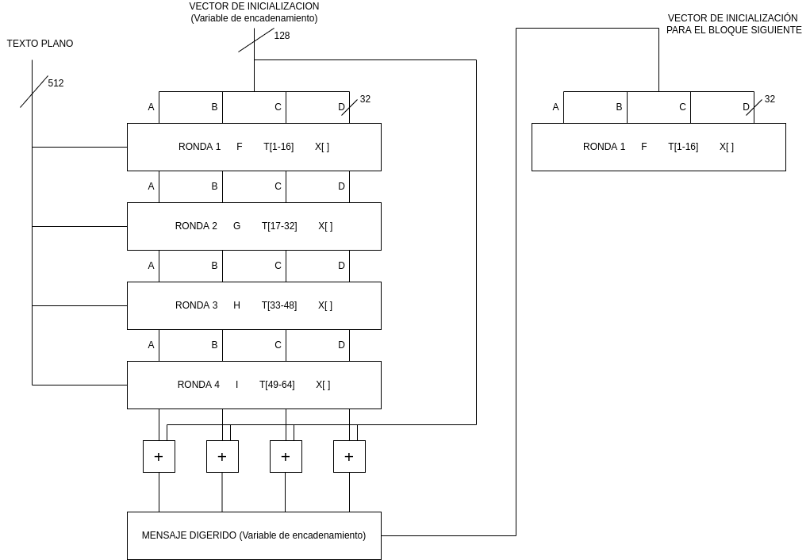

La salida de MD5 es message digest ("mensaje digerido"). El algoritmo mantienen la integridad.

1. Se genera el MD
2. *Append* el MD a texto plano
3. Lo envia al receptor
4. El que recibe genera el MD
5. El receptor compara su MD con el que recibió. Si son el mismo no se modificó en la transmisión

<h1> Algoritmo MD5 </h1>

La salida es MD de 128 bits

1. El texto plano se procesa en bloques de 512 bits. Si el largo es menos de 512, se le agrega bits de *padding*. 
2. Se le agrega representación en 64 bits del mensaje.

Luego de aplicar estos pasos, el largo del texto plano debería ser múltiplo de 512. Lo mismo ocurre si el texto plano está compuesto por más de un bloque de 512 bits. Entonces en el primer paso, el resultado debe quedar a 64 bits de ser múltiplo de 512.

3. Deben inicializarse los buffers de MD: se usan para almacenar el resultado. Cada buffer es de 32 bits. Para almacenar la salida se requieren entonces 4 buffers: A, B, C, D

4. Se procesa cada bloque de 512 bits

5. Salida (MD en los buffers A, B, C, D)

Cada bloque se procesa en 4 rondas. Luego de la ultima ronda se aplica el mismo módulo que en el principio (?)

4 rondas, cada una de 16 pasos con una constante para cada una y una funcion. Se procesan los bloques de texto plano de 512 bits. En total se usan 64 constantes (T). Entonces cada ronda usará una parte del texto plano, 16 constantes en 16 pasos y una función lógica de estos buffers. Todo esto para el primer bloque, para el segundo será lo mismo pero el vector de inicialización ser el MD obtenido con el bloque de 512 bits previo. El cuadrado con el + es adicion modulo 2 a la 32.

Ahora vemos cuales son las funciones logicas para cada ronda:

F(B,C,D) := (B and C) or (-B and D)
G(B,C,D) := (B and D) or (C and -D)
H(B,C,D) := B XOR C XOR D
I(B,C,D):= C XOR (B or -D)

`a = b + ((a + funcion(b,c,d) + X[k] + T[i]) <<< s)`  Esta ecuacion se realiza 16 veces por ronda. Los primeros 16 pasos se realiza con la funcion F, los otros con G, etc. X es parte del texto plano y T las constantes.
Asi se procesa el texto plano por 4 rondas y 64 pasos. La salida se guarda en A, B, C y D. Se realiza la adicion modulo con el vector inicializador y se obtiene la salida. Si se tiene más de un bloque, la salida de uno es la entrada de otro.

!(diagrama MD5 pero en vista de bits)[]

!(diagrama pero del single step de la ecuación)[]

[INDIO COMENTANDO LA RFC](https://www.youtube.com/watch?v=53O9J2J5i14)
